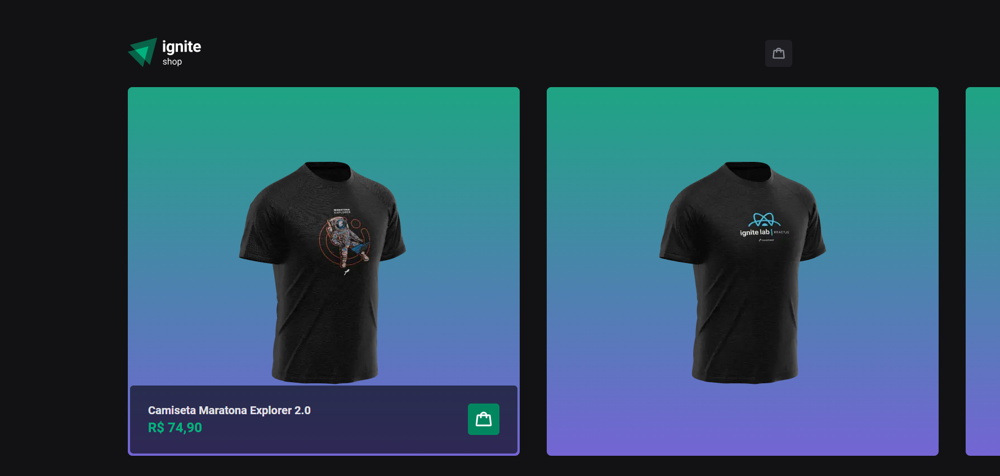
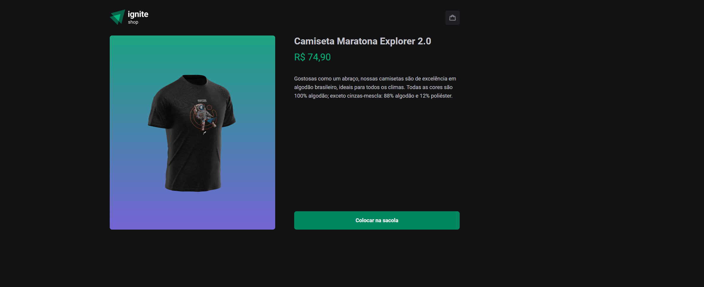
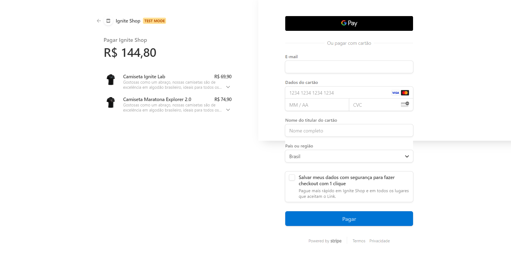

# Ignite Shop

## Descrição

O Ignite Shop é uma aplicação web de comércio eletrônico desenvolvida com o framework Next.js, que oferece uma experiência de compra intuitiva e moderna. A página inicial apresenta um carrossel de produtos, no caso, camisetas, com detalhes completos ao clicar em cada item. O processo de checkout é integrado com o Stripe, garantindo transações seguras e eficientes.







## Tecnologias

* **Next.js:** Framework React de produção para web.
* **Stitches:** Framework de design de sistema para criar componentes personalizados e reutilizáveis.
* **@radix-ui/react-dialog:** Biblioteca para criar componentes de diálogo acessíveis e personalizáveis.
* **axios:** Biblioteca para fazer requisições HTTP.
* **embla-carousel-react:** Biblioteca para criar carrosséis personalizados e responsivos.
* **Stripe:** Plataforma de pagamentos online.


## Como executar o projeto

1. **Clone o repositório:**
  ```bash
  git clone https://github.com/faelperini/05-ignite-shop
  ```

2. **Instale as dependências:**
  ```bash
  cd 05-ignite-shop
  npm install
  ```

3. **Inicie o desenvolvimento:**
  ```bash
  npm run dev
  ```

O aplicativo será iniciado em http://localhost:3000/

## Funcionalidades

* **Carrossel de Produtos:** A página principal exibe um carrossel com as camisetas disponíveis, permitindo uma navegação fácil e visualmente atraente.

* **Detalhes do Produto:** Ao clicar em uma camiseta, o usuário é direcionado para uma página com informações detalhadas sobre o produto, como imagem, descrição e preço.

* **Carrinho de Compras:** Os produtos selecionados são adicionados a um carrinho de compras virtual, onde o usuário pode visualizar os itens, quantidades e realizar alterações antes de finalizar a compra.

* **Checkout com Stripe:** A integração com o Stripe permite que os usuários finalizem suas compras de forma segura e conveniente, utilizando diversos métodos de pagamento.

* **SPA, SSR e SSG:** A aplicação combina as vantagens de Single-Page Application (SPA), Server-Side Rendering (SSR) e Static-Site Generation (SSG), proporcionando um excelente desempenho e experiência do usuário.

